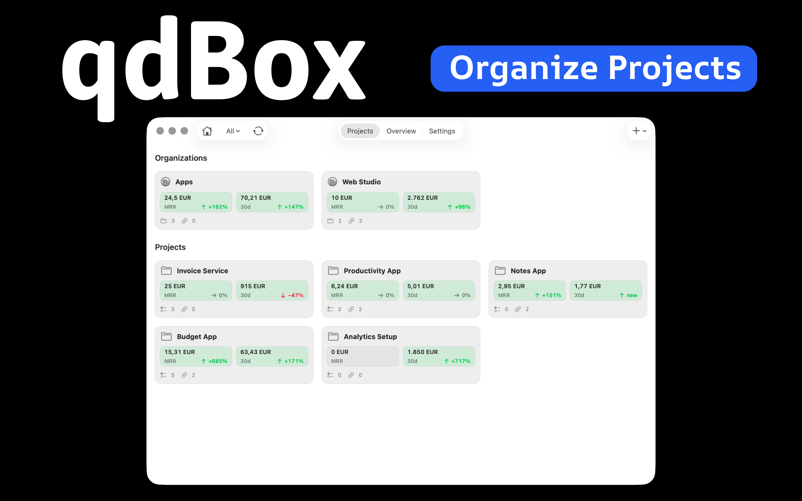
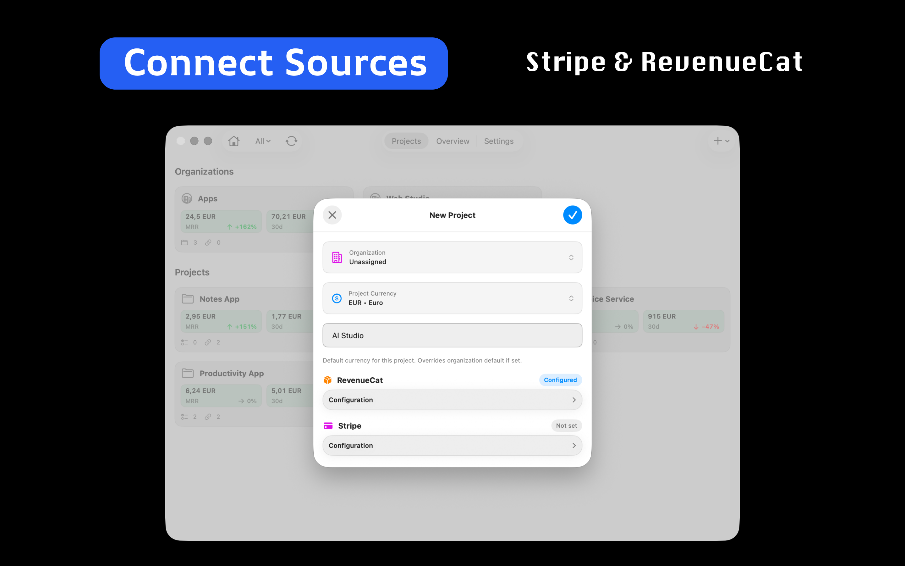
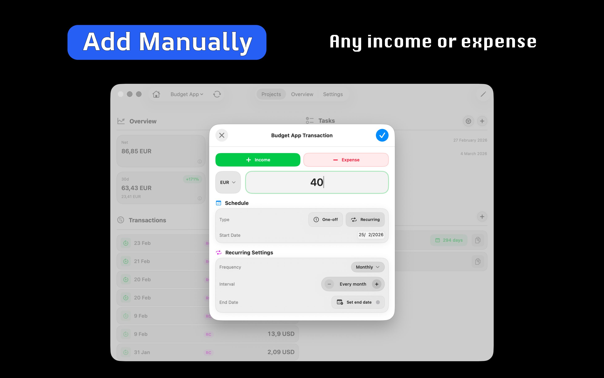
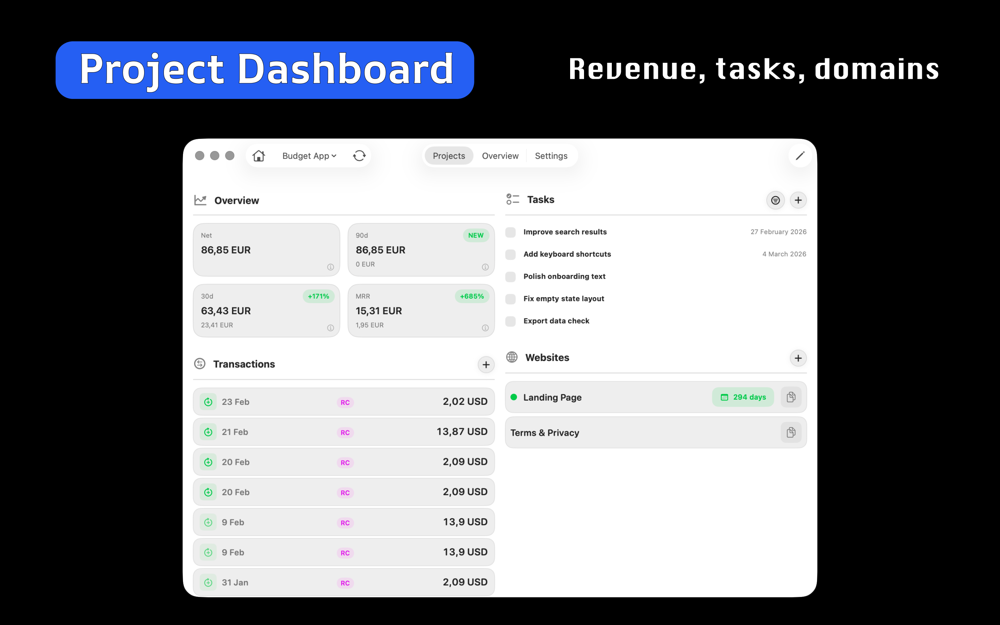
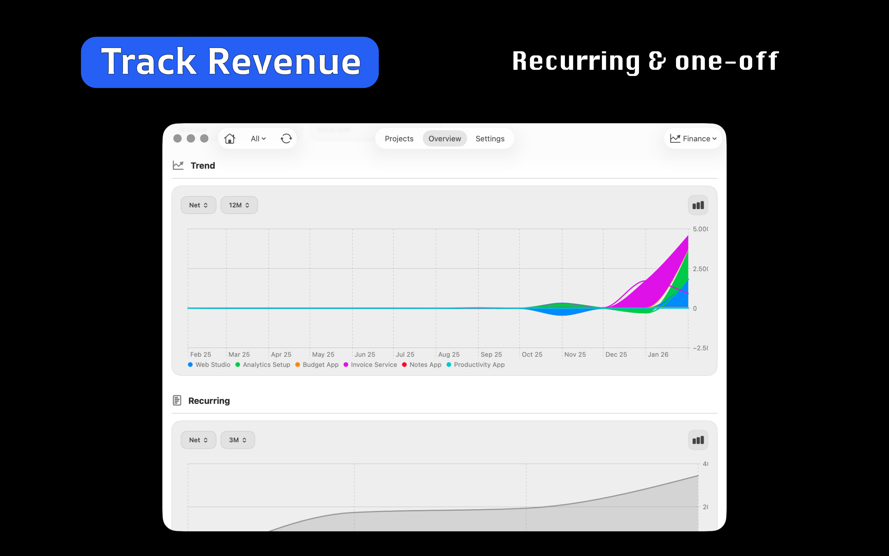

# qdBox

> Finance and operations dashboard for indie developers and SaaS founders.

qdBox is a finance and operations dashboard built for indie developers, solo founders, and small SaaS businesses. It brings revenue, subscriptions, projects, tasks, domains, and infrastructure details into one structured workspace.

## Project status

**Status:** Active  
**Type:** Apple app / SaaS-style tool  
**Code availability:** Private

## Platform / Availability

- iPhone
- iPad
- Mac

## Key features

- Revenue and MRR tracking
- Stripe and RevenueCat project monitoring
- Subscription and transaction overview
- Project and task organization
- Domain and infrastructure visibility
- Clean Apple-platform workflow
- Built for indie developers and SaaS founders

## Screenshots

## Links

- Website: https://qdbox.one/igp
- App Store: https://apps.apple.com/es/app/qdbox-projects-revenue/id6758437065
- Facebook: https://www.facebook.com/qdboxprojectstasksrevenuedashboard/
- LinkedIn: https://www.linkedin.com/company/qdbox/?viewAsMember=true
- X: https://x.com/stargap_one
- Portfolio page: https://stargap.one/products/qdbox
- GitHub repo: https://github.com/roqd-one/qdbox-app
- GitHub profile: https://github.com/roqd-one

## Suggested GitHub topics

`saas`, `mrr`, `revenue`, `stripe`, `revenuecat`, `indie-hackers`, `macos`, `ios`, `business-dashboard`, `project-management`

## Changelog

See [CHANGELOG.md](./CHANGELOG.md).

## Feedback / Issues

This repository serves as a public product page and lightweight documentation hub.

If you want to report a bug, suggest an improvement, or ask about the product, open an issue in this repository or use the contact path on the official website.

## Why this repo exists

This is a public showcase repository for qdBox — a place for product overview, screenshots, links, and lightweight release notes.

## Source code

qdBox is actively developed, but the application source code is private.

## Related projects

- [AirMQTT](https://github.com/roqd-one/airmqtt-app)
- [PostFox](https://github.com/roqd-one/postfox)
- [AlcoList](https://github.com/roqd-one/alcolist)
- [NowAgo](https://github.com/roqd-one/nowago)
- [StoreProof](https://github.com/roqd-one/storeproof-app)
- [LumiGap](https://github.com/roqd-one/lumigap-poker-ai)
